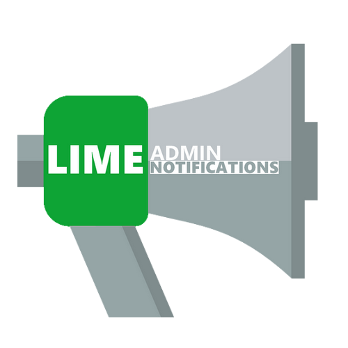
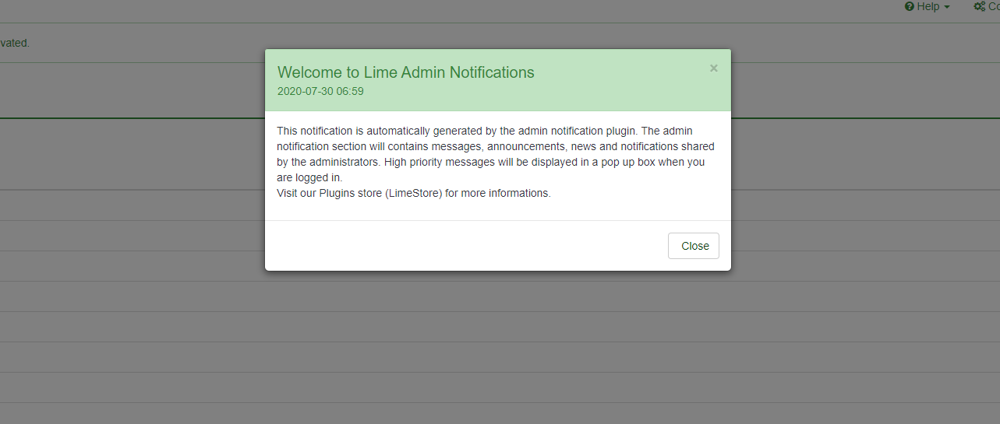
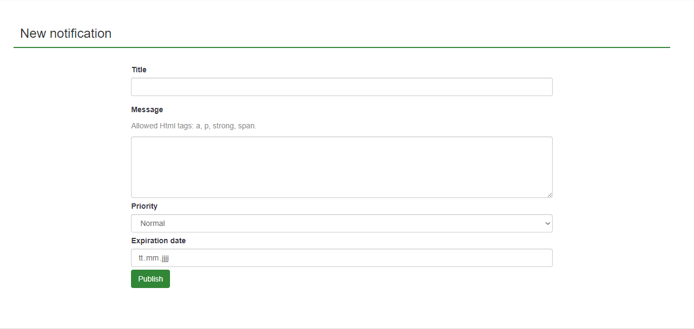
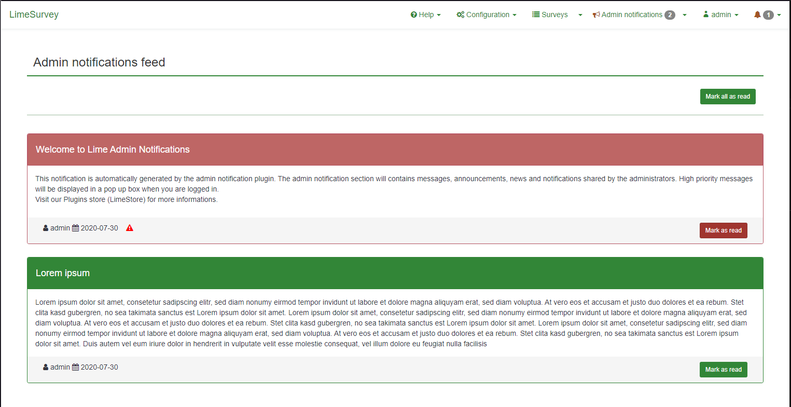
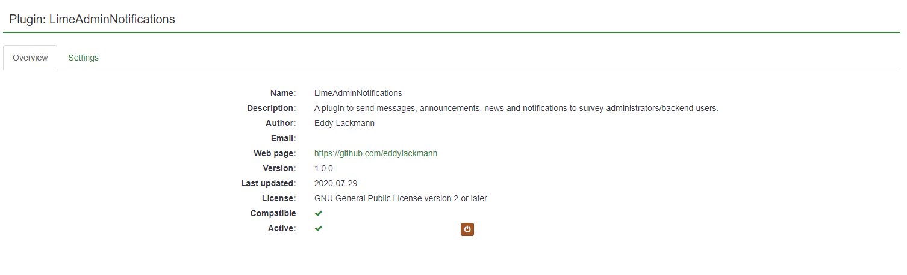

# LimeAdminNotification - LimeSurvey Plugin
A simple LimeSurvey plugin to share announcements, messages and notifications to all survey administrators / backend users

**Author**: Eddy Lackmann  
**Email**: a.eddy@hotmail.de  
**Website**: https://www.github.com/eddylackmann  
**Licence**: GPL 2.0 or later  
**LimeSurvey compatibility**: 3.X , 4.X

## Permissions: 
- **View notifications feeds**: no permissions needed
- **Manage notifications**: users-update permissions needed  

## Notes: 
- Only Admin users with "users-update" permissions are able to publish notifications (Acces to the notification Administration page)
- High priority notification will pop up when user is logged in until he marks it as read or the notification expired. 
- Notification with no expiration date will still show up in the feed.

## Screenshots

